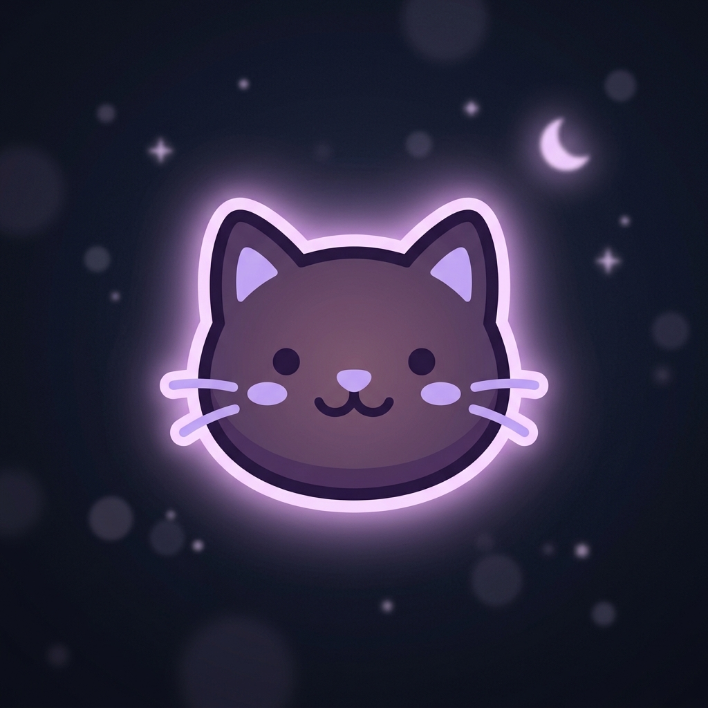

# 💜 Cozy Violet Night 🐾

Un tema oscuro estético con tonos violeta, lavanda y rosa pastel diseñado para **Antigravity IDE** y **VS Code**.

---

## 🎨 Características

### 1. 🎀 Snippets de Código Kawaii (Autocompletado)
Puedes usar estos accesos directos en archivos `.js`, `.ts`, `.md`, `.html`, `.css`:
- `cathead` + `Tab`: Inserta un encabezado de comentario decorativo.
- `catascii` + `Tab`: Inserta un arte ASCII.
- `catdiv` + `Tab`: Inserta una línea divisora decorativa.

### 2. 🎨 Paleta Pastel & Bracket Highlight
- **Editor Background**: `#13111c`
- **Cursor & Accents**: `#f472b6` (Rosa Sakura pastel)
- **Corchetes Coloreados (Rainbow Brackets)**: Rosa (`#f472b6`), Lavanda (`#c084fc`), Menta (`#818cf8`), Magenta (`#fb7185`).

---

## 📁 Estructura del Proyecto

- `extension.js`: Punto de entrada de la extensión.
- `snippets/cat-snippets.json`: Snippets decorativos.
- `package.json`: Manifiesto oficial del paquete.
- `themes/cozy-violet-color-theme.json`: Definición completa de colores TextMate.
- `icon.png`: Icono oficial del tema.
- `.vscode/settings.json`: Configuración lista para usar.
